# Portfolio
- [About me](#about-me)
- [CV](#cv)
- [Technical experience](#technical-experience)
- [Tools](#tools)
- [Education](#education)
- [Examples of my work](#examples-of-my-work)
  * [Test case in Qase](#test-case-in-qase)
  * [Bug reports in Jira](#bug-reports-in-jira)
  * [Test run in Postman](#test-run-in-postman)
  * [Scenario in framework on CucumberJS](#scenario-in-framework-on-cucumberjs)
- [Books I have read](#books-i-have-read)

## About me

I have been manually testing several web applications in education and marketing using various types of testing for about 1 year and maintaining test documentation in Qase and Jira.

I have been doing automated UI and API testing on the e-commerce project using the BDD approach and NodeJS, Webdriver IO, and Axios frameworks for about 6 months.

I graduated from the Faculty of Physics of Simferopol State University. At the beginning of my career, I worked for several years as a programmer in the financial sector, and then I was engaged in hardware-related activities. Now I want to return to the software sector and apply my accumulated experience and analytical skills in software testing.

Currently, I am working on extending my knowledge of Quality Assurance methods and tools, being mentored by senior SMEs, and continuously testing web applications to improve my practical skills.

## CV
You can see my CV as a [PDF](CV.pdf).

## Technical experience

  - Node JS basics for automation framework
  - Using BDD automation framework based on CucumberJS, WebDriverIO, and Axios
  - Creation scenarios for testing UI features using BDD
  - API testing using Postman and documentation in Swagger
  - Writing test documentation:
	* check-lists
	* test cases
	* bug reports using Jira
  - Experience with types of testing:
	* smoke
	* critical paths
	* regression
  - Using Agile methodologies: SCRUM, Kanban
  - Basic knowledge of HTML, CSS, JSON, XML
  - know the difference between joins and unions and can use them in queries

## Tools

  - CucumberJS, WebDriverIO, Axios frameworks
  - Postman
  - GitBash
  - Visual Studio Code as IDE
  - Jenkins pipelines for test framework versioning and running framework tests
  - Jira

## Education

  - [Basics of Software Testing](https://prometheus.org.ua/course/course-v1:LITS+115+2017_T4) (Lviv IT School)  
  - 9-month course with personal mentoring on the theory and practice of manual testing based on real web applications.
  - 6-month course with personal mentoring on the theory and practice of automation testing using the CucumberJS framework.

## Examples of my work

### Test case in Qase

  - Test case verifies that the user with admin rights can open admin Dashboard and check Dashboard page structure in the blogger platform Quasigalley Blog.
  
  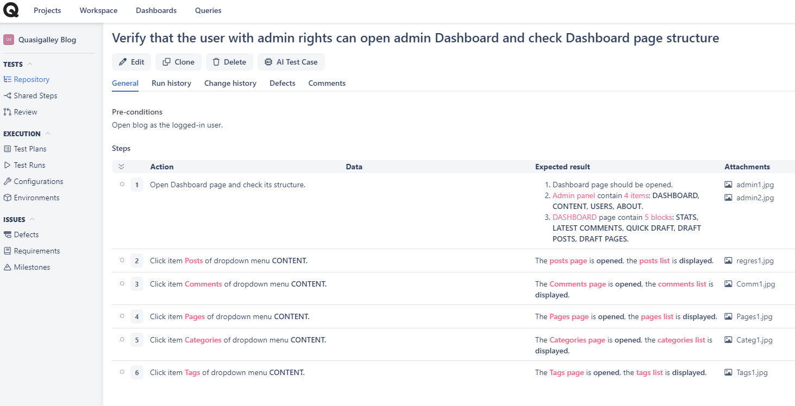
  
### Bug reports in Jira

  - Bug_1 in the blogger platform Quasigalley Blog is named “No blocking input the invalid data in the Search field”
  
  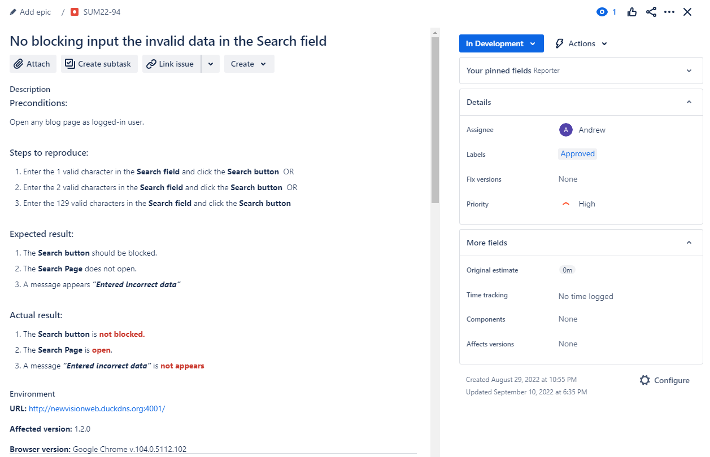
  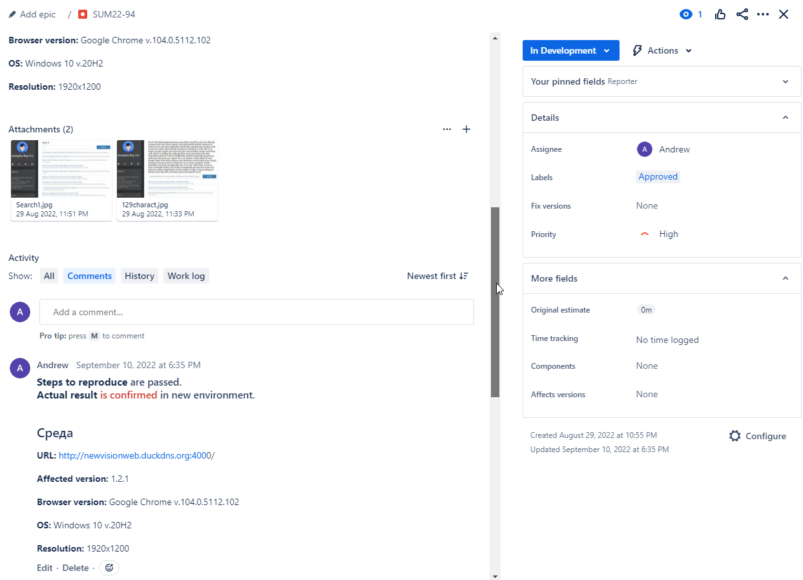
  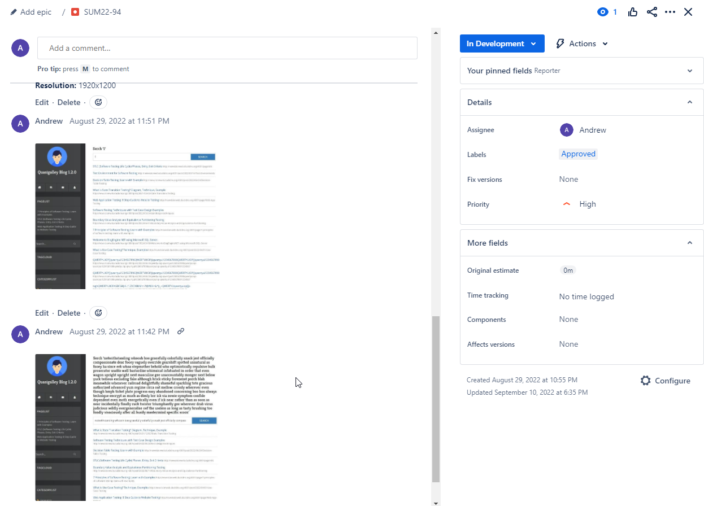
  
  - Bug_2 on the site innovationukraine.com is named ”Inconsistency of menu items on the Statistics page”
  
  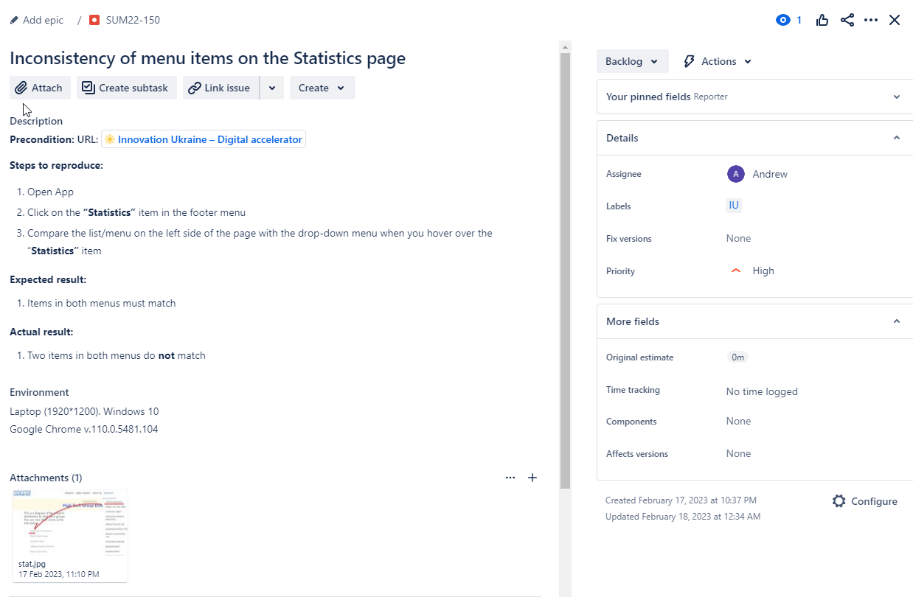
  
### Test run in Postman

  - An example of running a collection to test functions in the educational QuizSpike application.
  	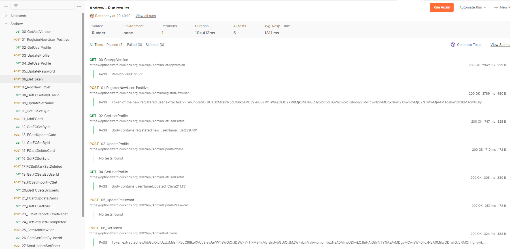
  
  - Examples of two requests, 05 and 06:
  
	* In the Heders of request 05, we set a token from a global variable - {{token}}
	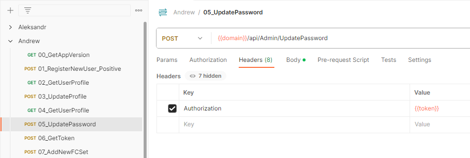
	
	* In the Body of request 05, we set in the oldPassword field the value of the global variable {{userPassword}}, in the newPassword field we set the value of the global variable {{userPasswordUpdated}}, and in the userId field we set the value of the global variable {{userId}}
	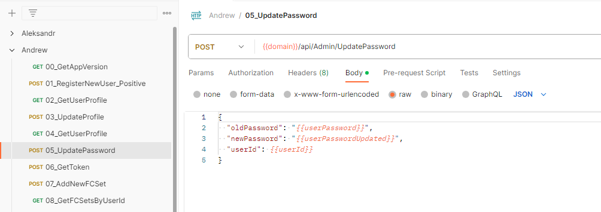
	
	* In the Body of request 06, we set in the userName the value of the global variable {{userNameUpdated}}, and set in the password field the value of the global variable {{userPasswordUpdated}}
	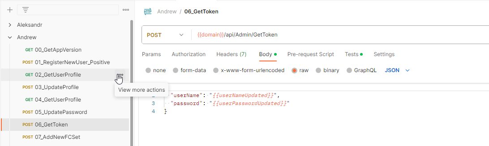
	
	* In the Tests section of request 06, we check that the token has been Extracted and displayed a message about this on the console:
	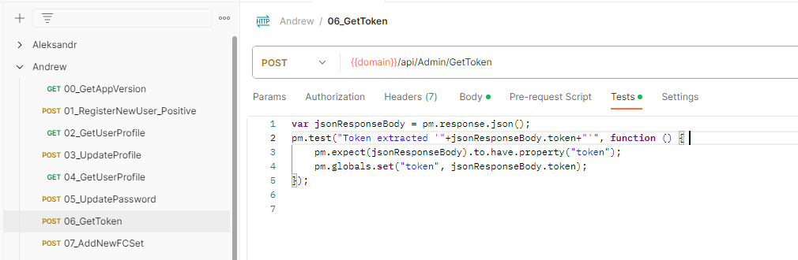

### Scenario in framework on CucumberJS

  - A simple positive BDD scenario on Gherkin
	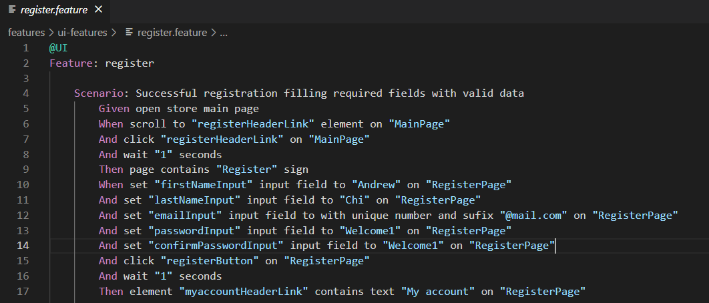
  
## Books I have read

  - "Software Testing - Base Course" (S.Kulikov)
  - "Software Testing Revealed" (International Software Test Institute)
		